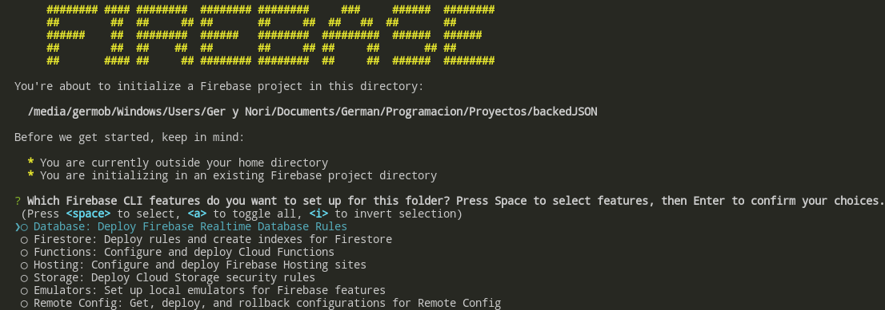
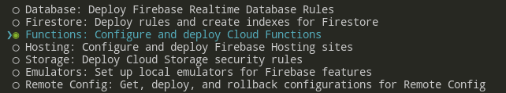
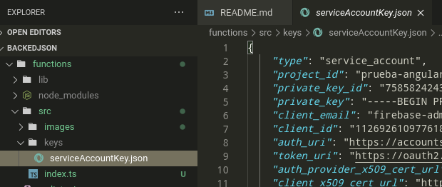

# EndPoint para subir información a Firebase mediante functions

Lo que contiene el descargable es el codigo, pero para poder ejecutarlo y poder aprovecharlo, primero se debe seguir los siguientes pasos:

1. Crear un carpeta llamada "backend" (puede llamarse como se quiera, pero si quiere seguir al pie de la letra el tutorial, llamela así). 

2. Abrimos la carpeta en el editor de codigo (yo usaré VisualStudio Code, pero se puede usar cualquiera).

3. Abrimos una terminal con dirección dentro de la carpeta (si es en VSCode podemos usar la terminal integrada). Y ejecutamos la siguiente linea:
~~~
firebase login
~~~
Esto nos permitirá saber si tenemos instalado firebase y si estamos inicializados.

4. En el caso de que nos ocurra un error porque no encuentra el comando `firebase`, entonces debemos instalarlo usando la siguiente linea de codigo:
~~~
sudo npm install -g firebase-tools
~~~

5. Volver a realizar el paso 3. Para realizar el Login, nos puede paedir email y contraseña en la linea de comandos o nos puede lanzar un pop up para elegir la cuenta.

6. Una vez que hayamos iniciado sesión, deberemos inicializar el proyecto. Para eso ejecutaremos la siguiente linea de codigo (tener en cuenta que la terminal debe estar abierta en la carpeta "backend"):
~~~
firebase init
~~~

Nos movemos entre las opciones usando las flechas direccionales y seleccionamos la opcion __Functions__ con la tecla espaciadora.

Nos preguntará que lenguaje usar, y seleccionamos *Typescript*

Nos preguntará si elegimos un proyecto ya existente o uno nuevo, aca se tiene que seleccionar lo que se necesite, yo recomiendo ya tener un proyecto inicializado en la cuenta con que logeamos el firebase y seleccionar *Use an existing proyect*, lo que nos dará la lista de proyectos de nuestra cuenta y alli seleccionaremos el proyecto que estemos usando.

Terminará la configuración y podremos empezar la instalación. 

7. Ahora debemos instalar las dependencias que usaremos para poder trabajar con servidores, para eso debemos abrir una terminal en la carpeta *functions* que se creo dentro de nuestra carpeta *backend* o, en su defecto ejecutar `cd functions` en la terminal que estabamos usando recien para que nos dirija a la carpeta. Luego ejecutar la siguiente linea de codigo:
~~~
sudo npm install express cors
~~~

8. Cuando esto termine, debemos darle credenciales a nuestro backend para que pueda trabajar sobre la base de datos, para eso nos vamos al proyecto en la pagina de firebase y, dentro dle proyecto, hacemos click sobre el icono de engranaje (arriba a la izquierda). Seleccionamos _Configuración del proyecto_ y nos vamos a la pestaña _Cuentas de servicio_. Le damos click a _Crear cuenta de servicio_ y nos colocamos en la opción _Node.js_. Bajamos y le damos click al botón _Generar nueva clave privada_, nos pedirá que confirmemos y nos desccargará una carpeta con un archivo .json. Ingresamos al archivo y copiamos todo lo que tenemos dentro.

9. Volvemos a nuestra carpeta *functions* y entramos a la carpeta *src*, ahi creamos una carpeta llamada *keys* y dentro creamos un archivo llamado *serviceAccountKey.json*. Dentro del archivo pegamos todo lo que copiamos en el punto anterior. Deberia quedar algo asi: 

10. Ahora podemos descargar el archivo _index.ts_ que se encuentra en este repositorio y reemplazar todo su contenido dentro de el archivo _index.ts_ que se encuentra en el proyecto que creamos.

11. Para probar el funcionamiento, abrimos una terminal dentro de la carpeta *functions* y colocamos la siguiente linea de codigo:
~~~
npm run build
~~~
Luego nos pasamos a la carpeta *backend* haciendo:
~~~
cd ..
~~~
Y ejecutamos el siguiente codigo:
~~~
firebase serve
~~~
Esto levantará un servidor que nos permitira poder probar la api.

### Prueba de la API

1. Cuando ejecutemos el comando `firebase serve`, nos mostrara una url de tipo:
~~~
http://localhost:5000/tu_proyecto/us-central1/api
~~~
Usando postman (o cualquier otro tester de API REST), llamamos esa url.

2. Petición GET: Si realizamos una petición GET, obtendremos la lista de todos los objetos que se encunetran en la colección de los JSONs.

3. Petición POST: Si realizamos una petición de tipo POST y enviamos por formato _x-www-form-urlencoded_ un objeto con todas las propiedades como si fuera un JSON, obtendremos como respuesta el objeto completo qe se ha agregado a la base de datos si todo sale bien, o un error si hay algun problema.